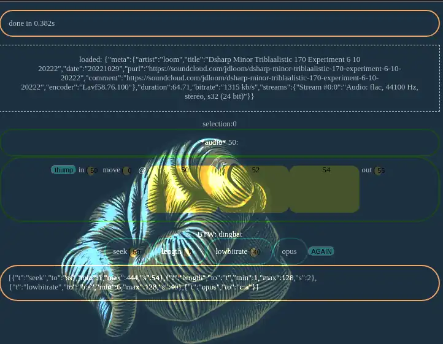

# bitzliten

Plays audio loops, mainly to listen test low opus bitrates.

# TODO

* ffmpeg-wasm or ffmpeg via http
* click seek
* knob seek, virtual radio for vast collections
* visual on the track
* other use cases for the same gear, eg:
  * music intelligence (key|rhythm)
  * live looping
  * editing stop-motion films
  * editing film
